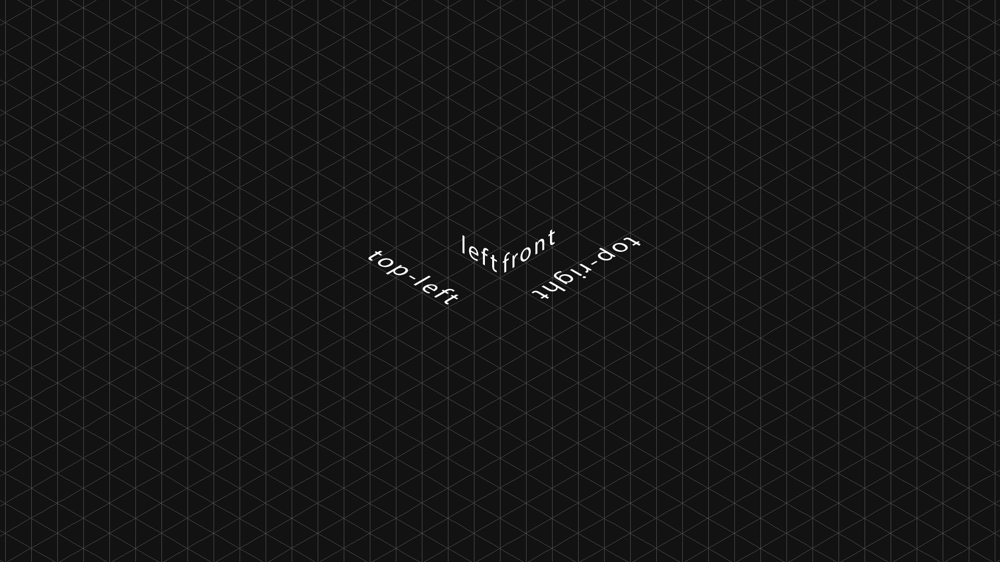

> isometric template and actions for Photoshop

&nbsp;

---

Geometry and angles, yeah...

Photoshop template and Actions to help when working with isometric styles in
your designs.

---

## Thank you!

This is based of the tutorial [here](https://design.tutsplus.com/tutorials/create-an-isometric-action-and-apply-it-to-an-icon-in-adobe-photoshop--cms-24814).

> https://design.tutsplus.com/tutorials/create-an-isometric-action-and-apply-it-to-an-icon-in-adobe-photoshop--cms-24814

Big thank you!
